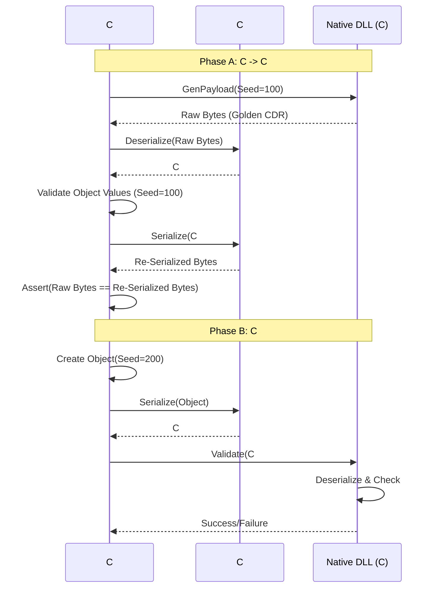

pls describe in details how the CshrpToC roundtrip tests are working. Waht it the principle. What is the role of the native dll. How the csharp part uses it. how to data content is gereated (the algorithm) and why it is like that. What is the sequence of individual steps, and what is checked in each. How the confidence in the correctness is ensured. Use details like class names etc.
---
The **CsharpToC.Roundtrip** tests function as a rigorous interoperability verification suite. Their primary purpose is to prove that the C# serialization logic (Managed Code) is **bit-perfect compatible** with the reference C implementation (Native Code) of CycloneDDS.

Here is a detailed breakdown of the working principles, components, algorithms, and execution flow.

---

### 1. The Core Principle: "The Native Oracle"

The fundamental principle is that the **Native C CycloneDDS implementation is the source of truth (The Oracle)**.
Since the C library is mature and proven, the C# implementation does not need to prove "logical correctness" in a vacuum; it only needs to prove that it **behaves exactly like the C library** on the wire.

*   If C produces bytes `0xAB 0xCD`, C# must produce `0xAB 0xCD`.
*   If C expects bytes `0x12 0x34` to mean `Value=10`, C# must decode `0x12 0x34` into `10`.

### 2. Role of the Native DLL (`ddsc_test_lib.dll`)

The test project loads a custom native DLL via P/Invoke. This DLL links against `libddsc` (CycloneDDS C) and exports specific helper functions.

**Responsibilities:**
1.  **Reference Serialization:** It uses the official C `dds_stream_write` (or internal serialization routines) to convert C structs into CDR byte streams.
2.  **Reference Deserialization:** It uses `dds_stream_read` to parse CDR byte streams back into C structs.
3.  **Validation Logic:** It contains the logic to check if a deserialized C struct matches a specific "Seed".

### 3. Data Generation Algorithm: "Deterministic Seeding"

To allow C# and C to verify each other without exchanging metadata, both sides implement identical **Deterministic Data Generators**.

**The Algorithm:**
Data is not random. It is mathematically derived from a single `int32 seed`.

*   **Primitives (int, long, short):**
    *   `Value = Seed + FieldIndex`
    *   *Example:* If Seed is 100, `field1 = 100`, `field2 = 101`.
*   **Floating Point (float, double):**
    *   `Value = (Seed + FieldIndex) + 0.5`
    *   *Example:* `100.5`, `101.5`.
*   **Strings:**
    *   Format: `"Str_<Seed>_<Index>"`
    *   *Example:* `"Str_100_0"`.
*   **Arrays/Sequences:**
    *   Length is usually fixed or derived from the seed (e.g., `seed % 5`).
    *   Elements are generated recursively using the primitive rules.
*   **Enums:**
    *   `Value = (Seed + Index) % EnumCount`.

**Why this approach?**
1.  **Stateless Verification:** The validator doesn't need the original object, just the Seed number.
2.  **Edge Case Coverage:** By varying the seed across tests, we can test boundary values (0, negative numbers, max string lengths) systematically.

---

### 4. Sequence of Steps (The `RunRoundtrip` Workflow)

The test orchestration happens in the `TestBase.RunRoundtrip<T>` method. It executes a **Two-Phase Verification**.

#### Phase A: Native C -> C# (Deserialization & Byte Match)

1.  **Request Generation (C# -> C):**
    *   C# calls a native function: `Native_GeneratePayload(topicName, seedA, out byte[] nativeBytes)`.
2.  **Native Serialization:**
    *   The DLL creates a C struct instance, populates it based on `seedA`, and serializes it using the CycloneDDS C serializer.
    *   It returns the raw CDR byte array (`nativeBytes`) to C#.
3.  **C# Deserialization:**
    *   C# uses `CdrReader` and the generated `T.Deserialize(ref reader)` code to parse `nativeBytes` into a C# Managed Object.
4.  **Logical Validation:**
    *   C# runs a `Validator(object, seedA)` function to ensure the properties (Ints, Strings) contain the expected values.
    *   *Check:* Did we read the data correctly?
5.  **Re-Serialization (The Golden Check):**
    *   C# takes the managed object and calls `T.Serialize(ref writer)` to produce `csharpBytes`.
6.  **Byte-Level Verification:**
    *   **Crucial Step:** `Assert.Equal(nativeBytes, csharpBytes)`.
    *   This verifies that C# produces the **exact same** alignment, padding, and header logic as the C implementation. This catches subtle errors like "3 bytes of padding vs 4 bytes".

#### Phase B: C# -> Native C (Serialization)

1.  **Object Creation:**
    *   C# creates a *new* Managed Object populated based on a **different seed** (`seedB`).
2.  **C# Serialization:**
    *   C# calls `T.Serialize(ref writer)` to generate `csharpBytesB`.
3.  **Native Validation:**
    *   C# passes these bytes to the DLL: `Native_ValidatePayload(topicName, csharpBytesB, seedB)`.
4.  **Native Deserialization:**
    *   The DLL uses the C deserializer to turn bytes into a C struct.
5.  **Final Verdict:**
    *   The DLL checks the C struct fields against `seedB`.
    *   Returns `true/false` to C#.

---

### 5. How Confidence is Ensured

The confidence level is extremely high due to the **Multi-Layered Verification**:

1.  **Logical Layer:** Checks that values (100, "Str_100") are preserved.
2.  **Physical Layer (The Golden Check):** The `nativeBytes == csharpBytes` check ensures that the C# serializer is indistinguishable from the C serializer.
    *   If C# adds 1 extra byte of padding, this fails immediately.
    *   If C# writes a 4-byte boolean instead of 1-byte, this fails.
3.  **Cross-Validation:**
    *   Phase A proves C# can *Read* what C wrote.
    *   Phase B proves C can *Read* what C# wrote.
4.  **XTypes Complexity:**
    *   The tests explicitly cover **XCDR1 (@final)** and **XCDR2 (@appendable)**.
    *   The Roundtrip logic validates that the correct headers (DHEADER, EMHEADER) and alignment rules are applied for specific extensibility kinds.

### 6. Key Components (Class Names)

*   **`TestBase`**: The abstract base class containing the `RunRoundtrip` logic.
*   **`DdsApi`**: The static class containing P/Invoke definitions to the native DLL.
*   **`CdrReader` / `CdrWriter`**: The low-level C# memory manipulators (Span-based) being tested.
*   **`SerializerEmitter`**: The code generator that produced the C# serialization logic being executed.
*   **`AtomicTests::{TopicName}`**: The specific test cases (e.g., `ArrayStringTopic`).

### Summary Diagram


---
This test is comprehensive but take an awfull lot of time to complete. I need something much much faster, allowing very fast iteration
of modifying serializaer/deserialize code - test if all ok.
Idea:
 - IDL with lots of topics (as now) one per test case.
 - For each test case we have CDR byte analysis, so we precisely know the structure of the CDR data stream
 - Phase 1: for each test case (topic)
    - Native sniffer sends the test sample,  grabs the golden CDR data stream ans SAVES IT To FILE.
    - This is only performed if file does not exist yet.
 - Phase 2: wire compatibility tests
    - C# deserializes the golden CDR stream, decodes the values and checks if they match with expectations.
	- C# serialize the test sample and compares the output with the golden CDR stream - if not matching, serializer is wrong.

We need a simplified procedure that changes & compiles only what necessary for current test case
   - generate the serializatin/deserialization code using the emitters (codegen)
   - compile the generated serializer/deserializer code
   - run test case, 
   - if passed
      - recall the changes of the generated code
	  - update the codeger emitters accordingly
      - re-run ALL the tests to be sure there is no regression
	  - if all ok, move to the next failing test case
	  - if failure (regression), analyze what has broken and try to fix all regressions together
   - if failed
      - look again at the CDR byte stream analysis
      - fix the generated serializer/deserializer (do not run codegen - that takes time)
	  - repeat the process from running the test case
   
We ned to generate a markdown guide that describes the process, part of instructions for the developer for every task.

Pls let's find the faster iteration way while keepiong the test strenght. Check if this process provides same quality guarantee. Evaluate if seed-based data filing makes sense, if we sould replace with hardcoded values.
Find optimal solution - fast and reliable.
---
This is a highly optimized workflow design. By decoupling the **Serialization Logic** from the **Native Runtime**, we transform integration tests (slow, complex) into unit tests (instant, simple).

Here is the comprehensive guide for the developer.

---

# Fast Iteration Guide: CycloneDDS C# Serializer Development

This guide defines a high-velocity workflow for fixing and verifying serialization logic without the overhead of full native roundtrips or repetitive code generation during the debugging phase.

## Core Concept: "Hot-Patching"

Instead of running the full `CodeGen -> Compile -> Run Native Test` cycle (which takes minutes), we use a **Golden Data** approach. We manually modify the generated C# code to fix bugs instantly, and only update the Code Generator (Emitter) once the logic is proven.

### The Principles
1.  **Golden Source:** The Native C implementation is the source of truth. We capture its output **once**.
2.  **Offline Verification:** We test C# logic against these captured files. No native DLLs, no network, no DDS participants.
3.  **Symmetry:** If `Deserialize(GoldenBytes) == Object` AND `Serialize(Object) == GoldenBytes`, the code is correct.

---

## Phase 1: Preparation (One-Time Setup)

### 1.1 Generate Golden Artifacts
We need to capture the wire format for every test case.
*   **Action:** Run the existing `CsharpToC.Roundtrip` suite with a special flag/mode enabled (e.g., `CAPTURE_GOLDEN_DATA = true`).
*   **Output:** A folder `./GoldenData/` containing:
    *   `AtomicTests_CharTopic.cdr` (The raw bytes from C)
    *   `AtomicTests_CharTopic.json` (The expected values/seed used, for verification)

### 1.2 The "Sandbox" Test Project
Create a small, lightweight .NET Console/Test project (`SerializerSandbox.csproj`) that references **only**:
*   `CycloneDDS.Core.dll` (The library containing `CdrReader`/`CdrWriter`)
*   The **Generated Code** folder (linked or copied).

**Crucially:** Do NOT reference `CycloneDDS.Runtime` or the Native DLL. This ensures sub-second compile times.

---

## Phase 2: The Fast Iteration Loop (The Developer Task)

Perform this cycle for each failing test case.

### Step 1: Reproduce Failure (Offline)
Create a unit test in the Sandbox for the specific failing topic (e.g., `TestArrayStringAppendable`).

```csharp
[Fact]
public void Debug_ArrayStringAppendable()
{
    // 1. Load Golden Data
    byte[] goldenBytes = File.ReadAllBytes("./GoldenData/AtomicTests_ArrayStringTopicAppendable.cdr");
    
    // 2. Deserialize
    var reader = new CdrReader(goldenBytes, CdrEncoding.Xcdr2);
    var obj = ArrayStringTopicAppendable.Deserialize(ref reader);
    
    // 3. Serialize back
    var writer = new CdrWriter(new byte[1024], CdrEncoding.Xcdr2);
    obj.Serialize(ref writer);
    byte[] resultBytes = writer.ToArray();
    
    // 4. Compare
    Assert.Equal(goldenBytes, resultBytes); // <--- Breakpoint here
}
```

### Step 2: Analyze & Hot-Patch (The Magic Step)
**Do NOT** modify `SerializerEmitter.cs` yet. Modify the **Generated C# File** (`AtomicTests.ArrayStringTopicAppendable.Serializer.cs`) directly.

1.  Run the test. It fails.
2.  Open the **CDR Analysis Document** provided earlier for this test case.
3.  Look at the `resultBytes` vs `goldenBytes` in the debugger.
    *   *Example:* "I see 4 bytes of padding at index 12, but Golden has none."
4.  Open `AtomicTests.ArrayStringTopicAppendable.Serializer.cs`.
5.  **Edit the code directly.**
    *   *Change:* Comment out `writer.Align(4);` or change `Align(8)` to `Align(4)`.
6.  Re-run the test (Ctrl+R, T).
    *   *Time taken:* ~2 seconds.
7.  Repeat until `Assert.Equal` passes.

### Step 3: Backport to Emitter
Once the generated file is fixed and the test passes:

1.  Compare the **Fixed Generated File** vs the **Original Generated File**.
2.  Identify the logic pattern (e.g., "Ah, we shouldn't align sequences of primitives in XCDR2").
3.  Apply this logic change to `SerializerEmitter.cs` (or `DeserializerEmitter.cs`).

---

## Phase 3: Validation & Regression

Once the Emitter is updated:

1.  **Regenerate All:** Run the CodeGen tool to overwrite all `.Serializer.cs` files with the new logic.
2.  **Regression Check:** Run the **Sandbox Test Suite** (all tests).
    *   If previous tests fail, your fix broke something else. Revert and refine the logic condition in the Emitter.
3.  **Final Verify:** Run the full `CsharpToC.Roundtrip` integration test (with Native DLL) to be 100% sure.

---

## Decision Matrix: Seed vs. Hardcoded Values

**Decision: Hybrid Approach.**

1.  **For Golden Data Generation (Native): Use Seed.**
    *   *Why:* We cannot easily hardcode complex C structs inside the C# test runner without massive P/Invoke boilerplate. The C-side generator `fill_data(seed)` is robust and already exists.

2.  **For C# Verification: Use Seed-Derived Determinism.**
    *   *Why:* Hardcoding expected values like `1.2345` in unit tests is tedious and error-prone for 110 tests.
    *   *Implementation:* Port the C `fill_data(seed)` logic to a C# helper class `DataGenerator.Create<T>(seed)`.
    *   *Workflow:*
        1.  Load `Topic.cdr` (Golden).
        2.  Generate `expectedObj = DataGenerator.Create<T>(seed)`.
        3.  `actualObj = Deserialize(Topic.cdr)`.
        4.  `Assert.Equivalent(expectedObj, actualObj)`.

---

## Summary Checklist for Developer

For the current failing test case:

1.  [ ] **Snapshot:** Ensure you have the `.cdr` file for the failing test.
2.  [ ] **Setup:** Open the generated `.Serializer.cs` file for that type.
3.  [ ] **Debug:** Run the comparison test. Look at the hex dump diff.
4.  [ ] **Patch:** Hack the `.Serializer.cs` file until the hex dumps match perfectly.
5.  [ ] **Generalize:** Translate your hack into a generic rule (e.g., "If XCDR2 and Primitive, skip header").
6.  [ ] **Update Emitter:** Modify `SerializerEmitter.cs` with that rule.
7.  [ ] **Verify:** Regenerate and ensure no regressions.

This process reduces the feedback loop from **~3 minutes** (full rebuild/test) to **~5 seconds** (hot-patch/test).
---
I would like to keep the current csharpToc.roundtrip tests and to create a new, parallel project named something like CsharpToC.Symmetry or something, using same (duplicated) test case idl, reusing (duplicating) lots of stuff from the roundtrip tests. In the fixture we make sure the golden CDR stream is generated (as hex byte dump - text file) for each test case. Tests will very quickly check the generated serialzation/deserialization code. There will be a powershell scripts  for full rebuild and running the tests accepting optional -Filter argument in xUnit style to select what test(s) to run. Then a second powershell that just runs the tests, accepting same -Filter argument.

Pls write detailed instruction how to build such a new test project.
---
Here is the detailed instruction set to build the **`CsharpToC.Symmetry`** project. This setup creates a high-speed testing environment that isolates serialization logic from the heavy native runtime after the initial data capture.

### 1. Directory & Project Structure

Create a new folder `tests\CsharpToC.Symmetry.Tests`.

**File Layout:**
```text
/tests/CsharpToC.Symmetry.Tests/
├── CsharpToC.Symmetry.Tests.csproj
├── atomic_tests.idl                 <-- Copy from Roundtrip
├── GoldenData/                      <-- Will store .txt hex dumps
│   ├── AtomicTests_ArrayStringTopic.txt
│   └── ...
├── Infrastructure/
│   ├── GoldenDataLoader.cs          <-- Manages file I/O
│   ├── HexUtils.cs                  <-- Byte <-> Hex conversion
│   └── SymmetryTestBase.cs          <-- Main logic
├── Native/
│   ├── DdsFactory.c                 <-- (Optional) If you need fresh native generation
│   └── NativeWrapper.cs             <-- P/Invoke (Copied from Roundtrip)
└── Tests/
    ├── Part1Tests.cs
    └── Part2Tests.cs
```

---

### 2. The Project File (`.csproj`)

Create `CsharpToC.Symmetry.Tests.csproj`.
**Crucial:** We disable default compilation of generated files during the "Hot-Patch" phase using the `RunOnly` configuration concept, but standard `Debug` works fine if we use `--no-build`.

```xml
<Project Sdk="Microsoft.NET.Sdk">

  <PropertyGroup>
    <TargetFramework>net8.0</TargetFramework>
    <Nullable>enable</Nullable>
    <IsPackable>false</IsPackable>
    <!-- Important: Allow unsafe blocks for CdrWriter -->
    <AllowUnsafeBlocks>true</AllowUnsafeBlocks>
  </PropertyGroup>

  <ItemGroup>
    <PackageReference Include="Microsoft.NET.Test.Sdk" Version="17.6.0" />
    <PackageReference Include="xunit" Version="2.4.2" />
    <PackageReference Include="xunit.runner.visualstudio" Version="2.4.5" />
  </ItemGroup>

  <ItemGroup>
    <ProjectReference Include="..\..\src\CycloneDDS.Core\CycloneDDS.Core.csproj" />
    <ProjectReference Include="..\..\src\CycloneDDS.Runtime\CycloneDDS.Runtime.csproj" />
    <!-- Reference CodeGen to ensure it builds, but we run it manually via targets -->
    <ProjectReference Include="..\..\tools\CycloneDDS.CodeGen\CycloneDDS.CodeGen.csproj" ReferenceOutputAssembly="false" />
  </ItemGroup>

  <!-- Import CodeGen Targets -->
  <Import Project="..\..\tools\CycloneDDS.CodeGen\CycloneDDS.targets" />

  <!-- Copy Native DLLs from the Roundtrip project if they exist, or define path -->
  <ItemGroup>
    <None Update="GoldenData\**\*">
      <CopyToOutputDirectory>PreserveNewest</CopyToOutputDirectory>
    </None>
  </ItemGroup>

</Project>
```

---

### 3. Infrastructure Code

#### A. `Infrastructure/HexUtils.cs`
Helpers to read/write the textual dump format.

```csharp
using System;
using System.Linq;
using System.Text;

namespace CsharpToC.Symmetry.Tests.Infrastructure
{
    public static class HexUtils
    {
        public static string ToHexString(byte[] bytes)
        {
            return BitConverter.ToString(bytes).Replace("-", " ");
        }

        public static byte[] FromHexString(string hex)
        {
            return hex.Split(new[] { ' ', '-', '\n', '\r' }, StringSplitOptions.RemoveEmptyEntries)
                      .Select(s => Convert.ToByte(s, 16))
                      .ToArray();
        }
    }
}
```

#### B. `Infrastructure/GoldenDataLoader.cs`
Responsible for fetching the "Truth". If the file is missing, it **calls the Native DLL** (borrowed from Roundtrip) to generate it once.

```csharp
using System;
using System.IO;
using System.Runtime.InteropServices;

namespace CsharpToC.Symmetry.Tests.Infrastructure
{
    public static class GoldenDataLoader
    {
        private const string Folder = "GoldenData";

        public static byte[] GetOrGenerate(string topicName, int seed)
        {
            string fileName = Path.Combine(AppContext.BaseDirectory, Folder, $"{topicName}.txt");
            
            // 1. Try Load File
            if (File.Exists(fileName))
            {
                return HexUtils.FromHexString(File.ReadAllText(fileName));
            }

            // 2. Generate via Native (One-time setup)
            // Ensure Directory Exists
            Directory.CreateDirectory(Path.GetDirectoryName(fileName)!);

            byte[] goldenBytes = GenerateNativeBytes(topicName, seed);
            
            // 3. Save to File
            File.WriteAllText(fileName, HexUtils.ToHexString(goldenBytes));
            
            return goldenBytes;
        }

        private static byte[] GenerateNativeBytes(string topicName, int seed)
        {
            // P/Invoke into your existing ddsc_test_lib.dll
            // This assumes the DLL is in the output directory (copied via script or csproj)
            IntPtr buffer = IntPtr.Zero;
            int len = NativeMethods.Native_GeneratePayload(topicName, seed, out buffer);
            
            if (len <= 0) throw new Exception($"Native generation failed for {topicName}");

            byte[] result = new byte[len];
            Marshal.Copy(buffer, result, 0, len);
            
            // Free native buffer if required by your DLL API
            // NativeMethods.Free(buffer); 
            
            return result;
        }
    }

    // Minimal P/Invoke wrapper duplicated from Roundtrip
    internal static class NativeMethods
    {
        [DllImport("ddsc_test_lib", CallingConvention = CallingConvention.Cdecl)]
        public static extern int Native_GeneratePayload(string topicName, int seed, out IntPtr buffer);
    }
}
```

#### C. `Infrastructure/SymmetryTestBase.cs`
The fast test logic.

```csharp
using System;
using Xunit;
using CycloneDDS.Core;

namespace CsharpToC.Symmetry.Tests.Infrastructure
{
    public abstract class SymmetryTestBase
    {
        protected void VerifySymmetry<T>(string topicName, int seed, Func<CdrReader, T> deserializer, Action<T, CdrWriter> serializer)
        {
            // 1. Get Golden Bytes (Fast file read)
            byte[] goldenBytes = GoldenDataLoader.GetOrGenerate(topicName, seed);

            // 2. Deserialize (C# Logic Check)
            var reader = new CdrReader(goldenBytes);
            T obj;
            try
            {
                obj = deserializer(reader); // e.g. T.Deserialize(ref reader)
            }
            catch (Exception ex)
            {
                throw new Exception($"Deserialization crashed on {topicName}. Error: {ex.Message}", ex);
            }

            // Optional: Validate object content using a managed DataGenerator (if available)
            // var expected = TestDataGenerator.Create<T>(seed);
            // Assert.Equivalent(expected, obj);

            // 3. Serialize (C# Writer Check)
            // Use a buffer slightly larger to detect overflows or alignment issues
            byte[] buffer = new byte[goldenBytes.Length * 2];
            var span = new Span<byte>(buffer);
            
            // Detect encoding from golden bytes (Byte 1) to configure Writer correctly
            CdrEncoding encoding = goldenBytes.Length > 1 && goldenBytes[1] >= 6 ? CdrEncoding.Xcdr2 : CdrEncoding.Xcdr1;
            
            var writer = new CdrWriter(span, encoding);
            
            try 
            {
                serializer(obj, writer);
            }
            catch (Exception ex)
            {
                throw new Exception($"Serialization crashed on {topicName}. Error: {ex.Message}", ex);
            }

            // 4. Verification
            byte[] resultBytes = writer.ToArray(); // Need helper to slice span to writer.Position
            
            // Manual Span slicing for comparison
            ReadOnlySpan<byte> actual = span.Slice(0, writer.Position);
            ReadOnlySpan<byte> expected = new ReadOnlySpan<byte>(goldenBytes);

            // Assert Length
            Assert.True(actual.Length == expected.Length, 
                $"Length Mismatch! Expected {expected.Length}, Got {actual.Length}.\nExpected: {HexUtils.ToHexString(goldenBytes)}\nActual:   {HexUtils.ToHexString(actual.ToArray())}");

            // Assert Content
            bool match = actual.SequenceEqual(expected);
            Assert.True(match, 
                $"Content Mismatch!\nExpected: {HexUtils.ToHexString(goldenBytes)}\nActual:   {HexUtils.ToHexString(actual.ToArray())}");
        }
    }
}
```

---

### 4. Implementation Example (`Tests/Part2Tests.cs`)

```csharp
using Xunit;
using CsharpToC.Symmetry.Tests.Infrastructure;
using AtomicTests; // Namespace of generated code

namespace CsharpToC.Symmetry.Tests
{
    public class Part2Tests : SymmetryTestBase
    {
        [Fact]
        public void TestArrayStringAppendable()
        {
            VerifySymmetry<ArrayStringTopicAppendable>(
                "AtomicTests::ArrayStringTopicAppendable", 
                1420, // Seed
                (reader) => ArrayStringTopicAppendable.Deserialize(ref reader),
                (obj, writer) => obj.Serialize(ref writer)
            );
        }

        [Fact]
        public void TestSequenceFloat64Appendable()
        {
            VerifySymmetry<SequenceFloat64TopicAppendable>(
                "AtomicTests::SequenceFloat64TopicAppendable",
                1234, 
                (reader) => SequenceFloat64TopicAppendable.Deserialize(ref reader),
                (obj, writer) => obj.Serialize(ref writer)
            );
        }
    }
}
```

---

### 5. PowerShell Workflow Scripts

Save these in the solution root or `tests/` folder.

#### A. `rebuild_and_test_symmetry.ps1` (Full Cycle)
Refreshes codegen, compiles everything, runs tests. Use when modifying Emitters.

```powershell
param (
    [string]$Filter = ""
)

$TestProj = "tests\CsharpToC.Symmetry.Tests\CsharpToC.Symmetry.Tests.csproj"

Write-Host "1. Cleaning previous build..." -ForegroundColor Cyan
dotnet clean $TestProj -v m

Write-Host "2. Building (Triggers CodeGen)..." -ForegroundColor Cyan
dotnet build $TestProj -c Debug

Write-Host "3. Running Tests..." -ForegroundColor Cyan
if ($Filter) {
    dotnet test $TestProj --no-build --filter "$Filter" --logger "console;verbosity=normal"
} else {
    dotnet test $TestProj --no-build --logger "console;verbosity=normal"
}
```

#### B. `run_symmetry_only.ps1` (Hot-Patch Loop)
Skips build/codegen. Runs explicitly against the `obj/` binaries. **This allows you to modify the `.Serializer.cs` files in `obj/Generated` manually and verify the fix immediately.**

```powershell
param (
    [string]$Filter = ""
)

$TestProj = "tests\CsharpToC.Symmetry.Tests\CsharpToC.Symmetry.Tests.csproj"

Write-Host ">>> HOT-PATCH MODE: Running without Rebuild <<<" -ForegroundColor Yellow

if ($Filter) {
    dotnet test $TestProj --no-build --filter "$Filter" --logger "console;verbosity=minimal"
} else {
    dotnet test $TestProj --no-build --logger "console;verbosity=minimal"
}
```

---

### 6. Developer Workflow (How to use this)

1.  **Initial Setup:**
    Run `rebuild_and_test_symmetry.ps1`. This generates the C# files in `tests/CsharpToC.Symmetry.Tests/obj/Generated/` and creates the `GoldenData` files by calling the native DLL.

2.  **Fixing a Failure (e.g., `SequenceFloat64`):**
    1.  Run `run_symmetry_only.ps1 -Filter "SequenceFloat64"`. It fails.
    2.  Open `tests/CsharpToC.Symmetry.Tests/obj/Generated/AtomicTests.SequenceFloat64TopicAppendable.Serializer.cs`.
    3.  **Edit the code directly** (e.g., change padding logic).
    4.  Run `run_symmetry_only.ps1 -Filter "SequenceFloat64"`.
    5.  Repeat 3-4 until it passes.

3.  **Finalizing:**
    1.  Take the logic from the working `.Serializer.cs`.
    2.  Apply it to `SerializerEmitter.cs`.
    3.  Run `rebuild_and_test_symmetry.ps1` (Runs CodeGen) to prove the fix works globally.
---
