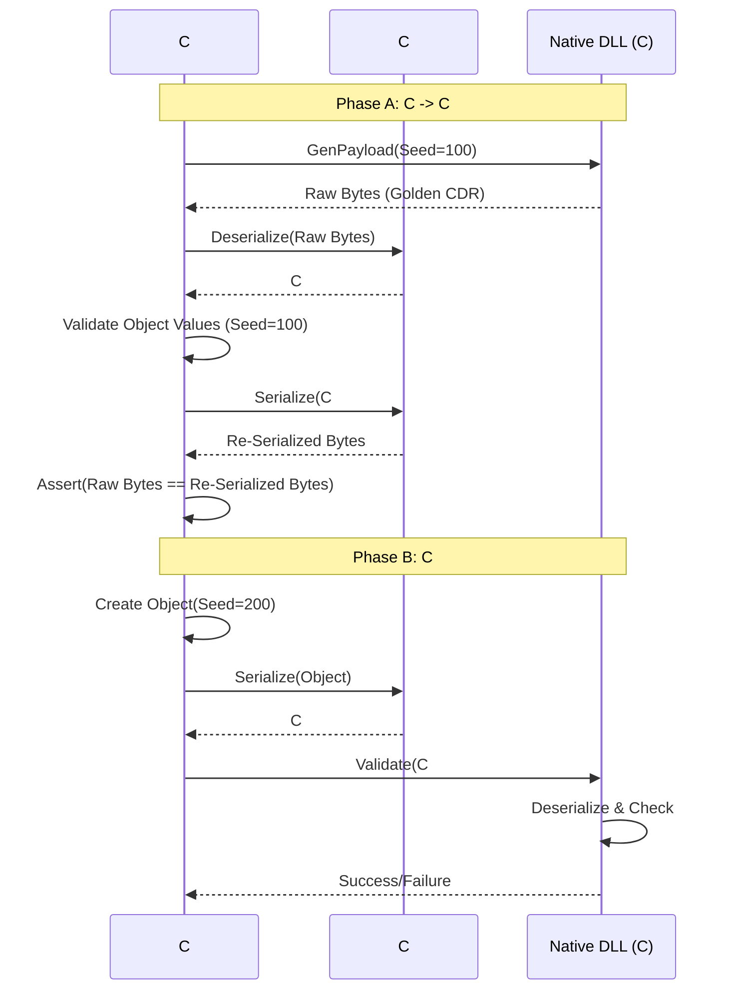

# C# to C Roundtrip Tests

**Minimalistic, Incremental DDS Interoperability Testing**

This test framework validates C# ↔ Native C DDS communication by testing **one feature at a time**. Unlike complex integration tests, each topic here is designed to be as simple as possible, making debugging straightforward.

The **CsharpToC.Roundtrip** tests function as a rigorous interoperability verification suite. Their primary purpose is to prove that the C# serialization logic (Managed Code) is **bit-perfect compatible** with the reference C implementation (Native Code) of CycloneDDS.

Here is a detailed breakdown of the working principles, components, algorithms, and execution flow.

---

### 1. The Core Principle: "The Native Oracle"

The fundamental principle is that the **Native C CycloneDDS implementation is the source of truth (The Oracle)**.
Since the C library is mature and proven, the C# implementation does not need to prove "logical correctness" in a vacuum; it only needs to prove that it **behaves exactly like the C library** on the wire.

*   If C produces bytes `0xAB 0xCD`, C# must produce `0xAB 0xCD`.
*   If C expects bytes `0x12 0x34` to mean `Value=10`, C# must decode `0x12 0x34` into `10`.

### 2. Role of the Native DLL (`ddsc_test_lib.dll`)

The test project loads a custom native DLL via P/Invoke. This DLL links against `libddsc` (CycloneDDS C) and exports specific helper functions.

**Responsibilities:**
1.  **Reference Serialization:** It uses the official C `dds_stream_write` (or internal serialization routines) to convert C structs into CDR byte streams.
2.  **Reference Deserialization:** It uses `dds_stream_read` to parse CDR byte streams back into C structs.
3.  **Validation Logic:** It contains the logic to check if a deserialized C struct matches a specific "Seed".

### 3. Data Generation Algorithm: "Deterministic Seeding"

To allow C# and C to verify each other without exchanging metadata, both sides implement identical **Deterministic Data Generators**.

**The Algorithm:**
Data is not random. It is mathematically derived from a single `int32 seed`.

*   **Primitives (int, long, short):**
    *   `Value = Seed + FieldIndex`
    *   *Example:* If Seed is 100, `field1 = 100`, `field2 = 101`.
*   **Floating Point (float, double):**
    *   `Value = (Seed + FieldIndex) + 0.5`
    *   *Example:* `100.5`, `101.5`.
*   **Strings:**
    *   Format: `"Str_<Seed>_<Index>"`
    *   *Example:* `"Str_100_0"`.
*   **Arrays/Sequences:**
    *   Length is usually fixed or derived from the seed (e.g., `seed % 5`).
    *   Elements are generated recursively using the primitive rules.
*   **Enums:**
    *   `Value = (Seed + Index) % EnumCount`.

**Why this approach?**
1.  **Stateless Verification:** The validator doesn't need the original object, just the Seed number.
2.  **Edge Case Coverage:** By varying the seed across tests, we can test boundary values (0, negative numbers, max string lengths) systematically.

---

### 4. Sequence of Steps (The `RunRoundtrip` Workflow)

The test orchestration happens in the `TestBase.RunRoundtrip<T>` method. It executes a **Two-Phase Verification**.

#### Phase A: Native C -> C# (Deserialization & Byte Match)

1.  **Request Generation (C# -> C):**
    *   C# calls a native function: `Native_GeneratePayload(topicName, seedA, out byte[] nativeBytes)`.
2.  **Native Serialization:**
    *   The DLL creates a C struct instance, populates it based on `seedA`, and serializes it using the CycloneDDS C serializer.
    *   It returns the raw CDR byte array (`nativeBytes`) to C#.
3.  **C# Deserialization:**
    *   C# uses `CdrReader` and the generated `T.Deserialize(ref reader)` code to parse `nativeBytes` into a C# Managed Object.
4.  **Logical Validation:**
    *   C# runs a `Validator(object, seedA)` function to ensure the properties (Ints, Strings) contain the expected values.
    *   *Check:* Did we read the data correctly?
5.  **Re-Serialization (The Golden Check):**
    *   C# takes the managed object and calls `T.Serialize(ref writer)` to produce `csharpBytes`.
6.  **Byte-Level Verification:**
    *   **Crucial Step:** `Assert.Equal(nativeBytes, csharpBytes)`.
    *   This verifies that C# produces the **exact same** alignment, padding, and header logic as the C implementation. This catches subtle errors like "3 bytes of padding vs 4 bytes".

#### Phase B: C# -> Native C (Serialization)

1.  **Object Creation:**
    *   C# creates a *new* Managed Object populated based on a **different seed** (`seedB`).
2.  **C# Serialization:**
    *   C# calls `T.Serialize(ref writer)` to generate `csharpBytesB`.
3.  **Native Validation:**
    *   C# passes these bytes to the DLL: `Native_ValidatePayload(topicName, csharpBytesB, seedB)`.
4.  **Native Deserialization:**
    *   The DLL uses the C deserializer to turn bytes into a C struct.
5.  **Final Verdict:**
    *   The DLL checks the C struct fields against `seedB`.
    *   Returns `true/false` to C#.

---

### 5. How Confidence is Ensured

The confidence level is extremely high due to the **Multi-Layered Verification**:

1.  **Logical Layer:** Checks that values (100, "Str_100") are preserved.
2.  **Physical Layer (The Golden Check):** The `nativeBytes == csharpBytes` check ensures that the C# serializer is indistinguishable from the C serializer.
    *   If C# adds 1 extra byte of padding, this fails immediately.
    *   If C# writes a 4-byte boolean instead of 1-byte, this fails.
3.  **Cross-Validation:**
    *   Phase A proves C# can *Read* what C wrote.
    *   Phase B proves C can *Read* what C# wrote.
4.  **XTypes Complexity:**
    *   The tests explicitly cover **XCDR1 (@final)** and **XCDR2 (@appendable)**.
    *   The Roundtrip logic validates that the correct headers (DHEADER, EMHEADER) and alignment rules are applied for specific extensibility kinds.

### 6. Key Components (Class Names)

*   **`TestBase`**: The abstract base class containing the `RunRoundtrip` logic.
*   **`DdsApi`**: The static class containing P/Invoke definitions to the native DLL.
*   **`CdrReader` / `CdrWriter`**: The low-level C# memory manipulators (Span-based) being tested.
*   **`SerializerEmitter`**: The code generator that produced the C# serialization logic being executed.
*   **`AtomicTests::{TopicName}`**: The specific test cases (e.g., `ArrayStringTopic`).

### Summary Diagram

